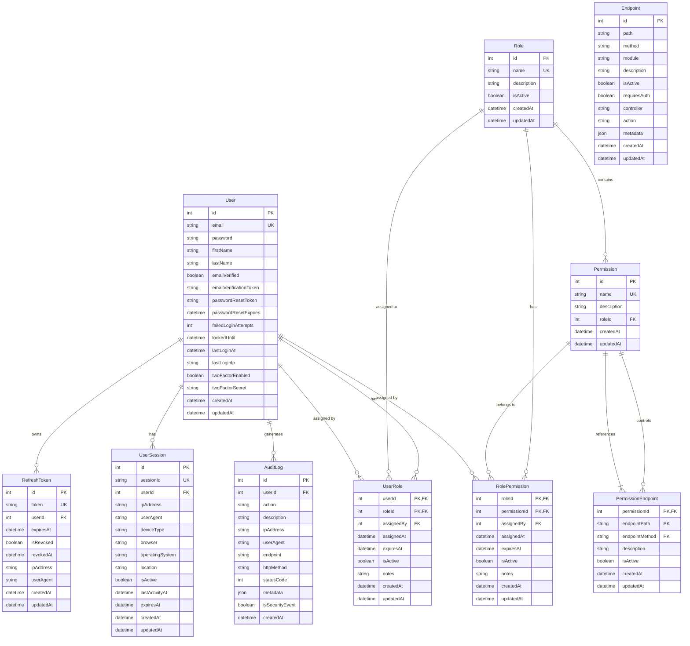

# Database Entity Relationship Diagram

## Key Features

### Security Enhancements
- **Account Security**: Email verification, password reset, failed login tracking, account lockout
- **Two-Factor Authentication**: Support for 2FA with secret storage
- **Session Management**: Refresh tokens and active session tracking with device fingerprinting
- **Audit Logging**: Comprehensive security event tracking

### Permission System
- **Flexible Role-Permission Model**: Many-to-many relationship with audit trails
- **Semantic Endpoint Linking**: Permissions linked to specific endpoint paths and HTTP methods
- **Temporal Permissions**: Support for expiring role and permission assignments

### Data Integrity
- **Composite Primary Keys**: PermissionEndpoint uses (permissionId, endpointPath, endpointMethod)
- **Unique Constraints**: Email, session IDs, refresh tokens
- **Referential Integrity**: Proper foreign key relationships with cascade options

### Performance Optimizations
- **Strategic Indexes**: On frequently queried fields (email, session IDs, tokens)
- **Efficient Queries**: Optimized for common authentication and authorization patterns

### Audit & Compliance
- **Complete Activity Tracking**: All user actions logged with metadata
- **Security Event Monitoring**: Special flagging for security-related events
- **Temporal Data**: Creation and update timestamps on all entities